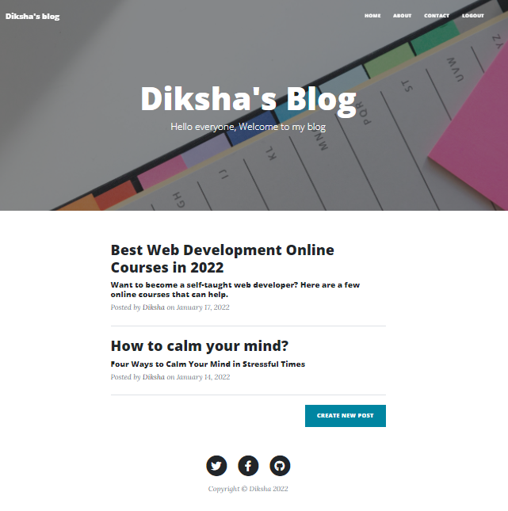
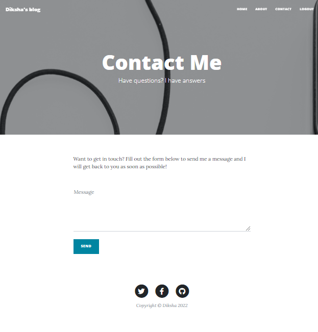
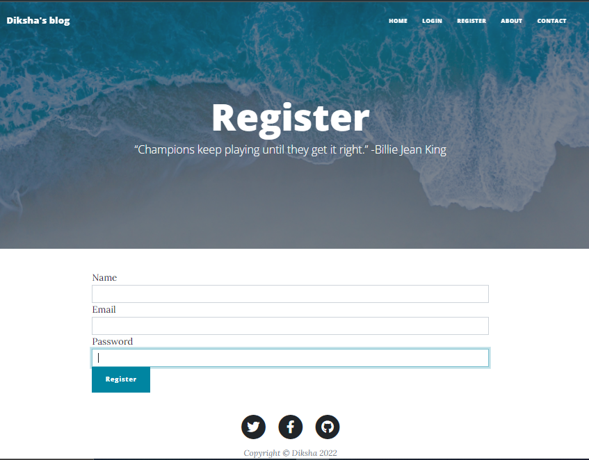
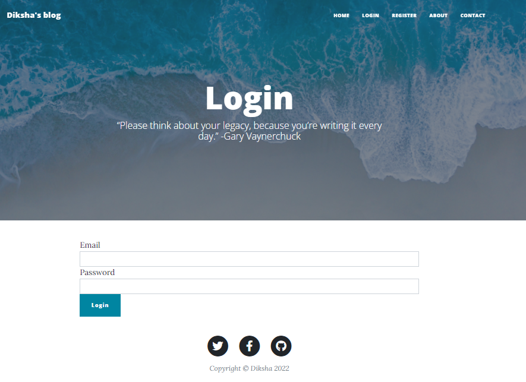
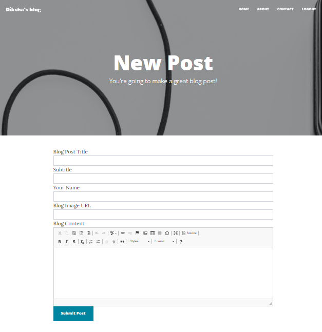
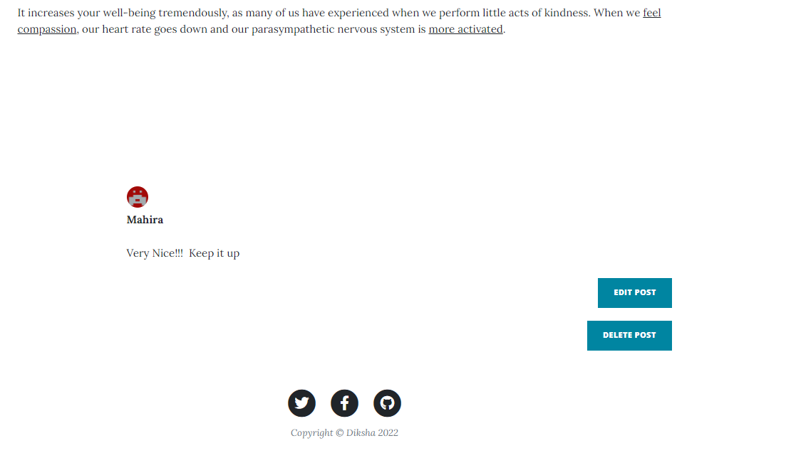
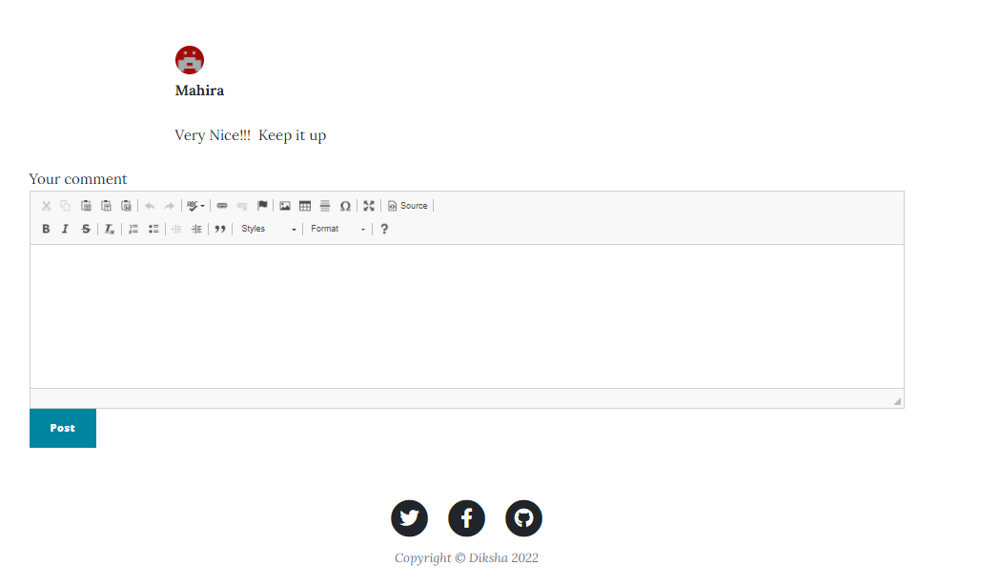

# blog-upgrade

### Home Page

### Blog Post example

### About Page

### Contact Page

### Register Page

### Login Page

## Admin Only Privileges

### Add new posts

### Update or delete existing posts

## Logged In user

#### can add comments to the posts

